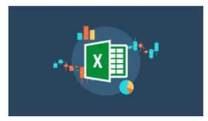

 

<h1 align="center"> Udemy - Macros VBA para Excel </h1>

O curso de Macros VBA para Excel, ministrado pelo professor João Paulo de Lira, ensina a automatizar tarefas e rotinas no Excel. Inicialmente, conhecemos o ambiente de trabalho, como funciona o VBA e as Macros até rotinas complexas de preenchimento automático, eventos, criação de formulários completos, fórmulas e dentre outros ensinamentos. Ao longo do curso,aprendemos a montar nossas próprias ferramentas, com o intuito de acelerar as tarefas no Excel.

 

  

 

  <a href="#-tecnologias">🚀 Tecnologias</a>&nbsp;&nbsp;&nbsp;|&nbsp;&nbsp;&nbsp;
  <a href="#-certificado">📜 Certificado</a>&nbsp;&nbsp;&nbsp;|&nbsp;&nbsp;&nbsp;
  <a href="#memo-licença">:memo: Licença</a>

 

## 🚀 Tecnologias

Neste curso foi utilizada a linguagem do VBA (Visual Basic for Applications). 

 

## 📜 Certificado

Conclusão do Curso: 03/08/2023

  

 

## :memo: Licença

Esse projeto está sob a licença MIT.

---

Desenvolvido por [Thiago Honorato](https://www.linkedin.com/in/honoratothiago/)
